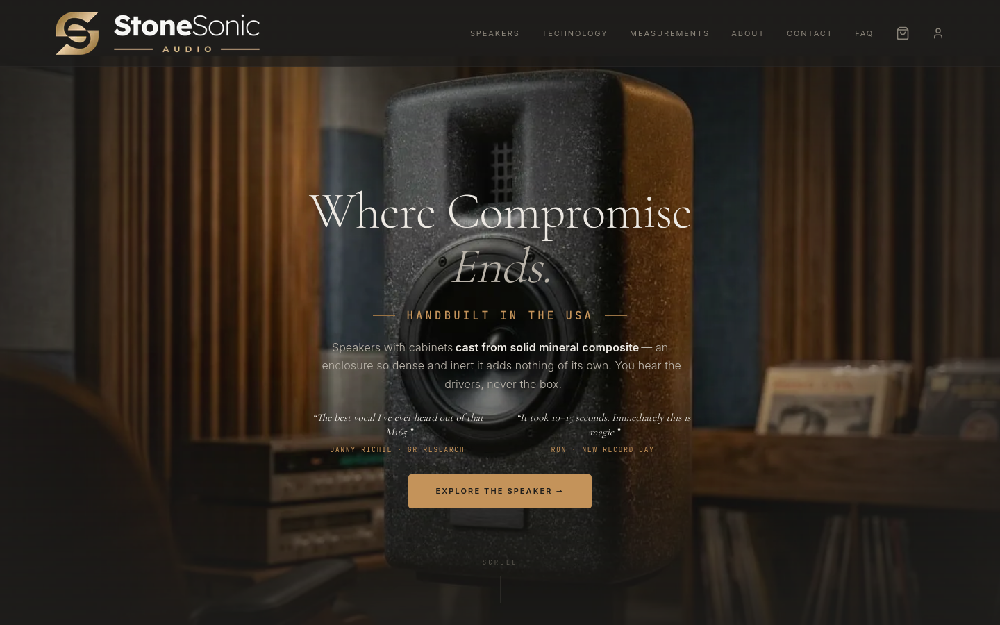
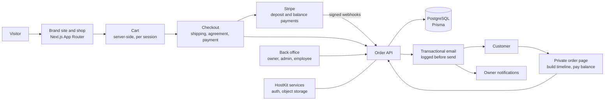

# StoneSonic Audio

**The storefront and back office for a maker of handbuilt concrete-cabinet loudspeakers: deposit-first checkout, a nine-stage build pipeline, signed purchase agreements and the business tools to run it.**

Live: [stonesonicaudio.com](https://stonesonicaudio.com)

---

## What it is

StoneSonic Audio builds high-end loudspeakers with cast-concrete cabinets and sells them direct. Every pair is made by hand after it is ordered, so the business doesn't fit the usual "add to cart, ship tomorrow" shop. A customer reserves a pair with a deposit and signs a purchase agreement. The pair then goes through production, curing and finishing, the balance is paid when it is ready, and only then does it ship.

This project is the whole system behind that: the brand site and shop customers see, and the back office the business runs on. Orders, payments, agreements, build progress, customer email, finances, content and the mailing list all live in one place.

## Highlights

- **Checkout built for made-to-order.** The customer pays a deposit per pair at checkout and the balance later. Card or US bank transfer (ACH) through Stripe, with a discount for paying by bank. Coupons, a concrete stand add-on, and Utah sales tax at the city rate where one applies. Every price, discount, tax amount and balance is recomputed on the server from the database. Nothing the browser sends is trusted.
- **A build pipeline the customer can watch.** Each order moves through nine stages: deposit processing (for bank transfers), deposit received, in production, curing, finishing, balance due, ready to ship, shipped and delivered. One click advances it. The customer gets an email for that stage and can follow a dated build timeline on a private order page. The owner is notified of every new order, cleared deposit, stage change and paid balance.
- **Signed, versioned purchase agreements.** Customers sign the agreement during checkout. Each signature records the exact agreement version and a SHA-256 hash of its text, and the customer is emailed a copy with a PDF download. In the back office, agreement versions are drafted, previewed and published. A published version can't be edited, and a version anyone has signed can't be deleted.
- **A back office with eleven sections.** Overview, products, orders, agreements, finances, email log, blog, mailing list, coupons, team and settings. There are three roles: owner, admin and employee. Employees see only the overview and orders, and only the owner manages the team.
- **Finances without a spreadsheet.** Pick a date range and see gross and net revenue, the Stripe fees on each order (pulled from Stripe automatically), card versus bank-transfer orders, tax collected by jurisdiction, and margin per order based on each finish's cost. All of it exports to CSV.
- **Lead times that follow the queue.** The owner can type a lead time in by hand, or set how many days one pair takes to build. In that mode the shop shows an estimate worked out from the number of orders in the queue.
- **Content and audience tools.** A blog that can import new videos from the brand's YouTube channel as posts, a mailing list with sign-up points across the site, a welcome email and CSV export, and a measurements page that pairs the original bench plots with full-range response estimates drawn in code from the measurement data.

## The brief and the outcome

**What StoneSonic needed.** A speaker line that had no store of its own needed a brand and a direct-to-customer shop to match an expensive, handbuilt product. The way the business sells had to work end to end: a deposit up front, weeks of build time, a balance before shipping, and a signed agreement setting out those terms. The owner needed to run it with a small team and without a stack of separate tools.

**What Emergent delivered.** A custom Next.js storefront and admin, built on Emergent's in-house [HostKit](https://github.com/codeslayer44/hostkit-showcase) platform and live at stonesonicaudio.com. The project started on 28 March 2026, and the first day's work covered the brand system, the cinematic homepage, the shop and the cart. Over the following six months it grew into the full order-to-delivery system described here, and it still ships regular improvements: a new finish, listener testimonials with video moments, editing an order's customer details from the admin.

**What it changed.** Taking a deposit, collecting the signed agreement, keeping the customer posted through the build, requesting and collecting the balance, and recording the tracking number all happen in one system. The customer gets the right email at the right time without anyone writing it. The owner sees the whole build queue on one screen, can check any email that was sent, and has the revenue, fee and sales-tax figures for any period ready to export.

## Architecture

The public site, the checkout, the customer's order page and the admin are one Next.js application backed by PostgreSQL through Prisma. Checkout is four steps: cart review, shipping, purchase agreement, payment. Payment uses Stripe Payment Intents, one for the deposit and a second created when the balance falls due. Card deposits are confirmed straight away. Bank-transfer deposits enter a "processing" stage and move forward only when Stripe's signed webhook says the money has cleared. Every customer-facing change sends an email, and every email is written to a log before it goes out. Login, team accounts and image storage come from HostKit's shared services.

The full walk-through is in [docs/architecture.md](docs/architecture.md).

## Engineering notes

**Modelling a business that builds after you pay.** The first version was a conventional shop with stock counts and "sold out" badges. Once it was clear that every pair is built to order, the stock checks were removed and the order itself became the unit of work. The deposit is a fixed amount per pair, set in the admin and capped at the order total so a small order is never overcharged. The balance is whatever remains after coupons, the bank-transfer discount and tax. If the deposit already covers everything, the pipeline skips "awaiting payment" and marks the order paid in full. Choosing bank transfer changes the balance, not the deposit, so the amount the customer already agreed to pay today never moves.

**An agreement you can prove later.** A signature isn't just a checkbox. It stores the version signed, a SHA-256 hash of that version's exact text, the time, and basic request details. Agreement versions are data, not code: the owner can draft and preview a new one, but publishing it locks it for good. A version with signatures can't be deleted, and the database refuses to drop a version that a signature still points to. Whenever there's a question about what a customer agreed to, the answer is in the record, and it matches the PDF they were sent.

**Payments that can't be double-counted.** Order creation is keyed to the Stripe deposit payment: a unique constraint means a double-submit or a retried request returns the order that already exists instead of creating a second one. The ACH webhook handlers act only if the order is still waiting on that payment, so a repeated webhook is harmless. Stripe's processing fee is read from the charge itself and stored on the order, which is what lets the finance page show real net revenue instead of an estimate.

**Every email on the record.** Customers get a lot of email from a made-to-order purchase: deposit received, each build stage, balance due, reminders, shipped, delivered. The email layer writes the full rendered message to a log before sending, stores the email provider's message ID, and marks the record failed if sending fails. The admin's email log can be filtered by type, recipient and date and shows each message exactly as it went out. "Did the customer get the balance email?" has a definite answer.

**Measurements drawn from data.** The measurements page shows the original bench plots, each with a one-line plain-English reading for listeners who don't read graphs. Bench measurements stop at about 200 Hz, so the page adds two full-range estimates drawn as SVG in code: the measured points above 200 Hz joined to a modelled bass roll-off below (labelled as modelled), and an in-room curve that applies a typical room tilt to the same data. Data, captions and styling live together, so updating an estimate is a data change, not a redesign.

## Tech stack

| Layer | Technology |
|---|---|
| App | Next.js 16 (App Router), React 19, TypeScript |
| Database | PostgreSQL via Prisma 7, 12 SQL migrations |
| Payments | Stripe Payment Intents and Payment Element (card and US bank account), signed webhooks |
| Email | Resend, with every message logged in the database |
| Documents | `@react-pdf/renderer` for purchase-agreement PDFs |
| Forms and validation | react-hook-form and zod on both the client and the server |
| UI | Tailwind CSS 4, Radix primitives, Framer Motion |
| Platform | [HostKit](https://github.com/codeslayer44/hostkit-showcase): auth (password and magic link), object storage for product images, shared admin table components, hosting |

## By the numbers

| | |
|---|---|
| Commits | 112 (2026-03-28 to 2026-09-29) |
| Source lines | 30,925 |
| Tracked files | 424 |
| SQL migrations | 12 |
| API routes | 65 |
| Public pages | 22 |
| Back-office sections | 11 |
| Order stages | 9, plus cancelled |
| Email templates | 14 customer and team emails, plus owner notifications |
| Languages | TypeScript 89.7%, HTML 9.3% |

API routes, pages, sections and email templates were counted directly in the source.

## Screenshots

**Arcus speaker product page**

**Published speaker measurements**

## About this repo

StoneSonic's source code is private. This repository documents what was built and how it works, and contains no source code from the project.

Built by [Emergent AI Agency](https://emergentaiagency.com) (Ryan Chappell, [@codeslayer44](https://github.com/codeslayer44)) for StoneSonic Audio. Emergent builds and runs client apps on its in-house platforms, [HostKit](https://github.com/codeslayer44/hostkit-showcase) and [NextAgent](https://github.com/codeslayer44/nextagent-showcase).

For enquiries: [emergentaiagency.com](https://emergentaiagency.com).
