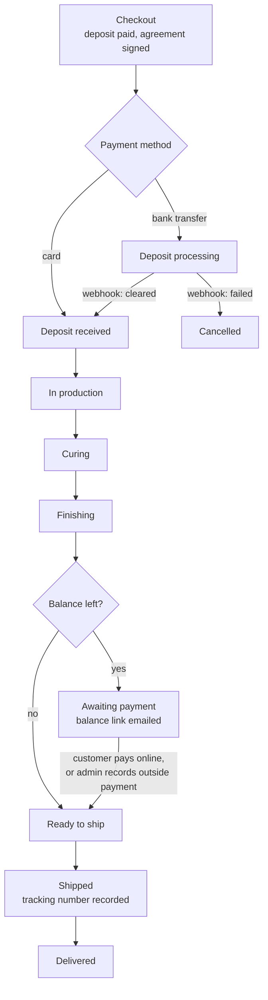

# StoneSonic Audio: architecture

This page goes one level deeper than the [README](../README.md): what the parts are, how an order moves through them, and why the main decisions were made. The source code is private; nothing here is copied from it.

## Components

| Part | What it does |
|---|---|
| Brand site | Homepage, story, technology, measurements, FAQ, blog, contact. Scroll-revealed editorial sections, listener testimonials with timestamped video moments, mailing-list sign-ups placed throughout. |
| Shop | Product pages with a finish selector, the concrete stand add-on, the current lead time and the deposit amount, a "made to order" badge in place of stock levels, and a sticky reserve bar on mobile. |
| Cart | Server-side cart tied to a session cookie, with a slide-out drawer that shows the deposit due today. |
| Checkout | Four steps: cart review, shipping address, purchase agreement, payment. Promo codes can arrive in a link and are kept for a week. |
| Customer order page | A private link, sent in every order email, showing the order, a dated build timeline, the tracking number once shipped, and the balance payment form when the balance is due. Customers with an account also see their orders on a dashboard. |
| Back office | Eleven sections (below), gated by role. |
| Order API | Route handlers for checkout, order actions, webhooks and admin data. Inputs are validated with zod schemas shared with the forms. |
| Email layer | One send function used by every email in the app: it logs the message, sends it through Resend and records the outcome. |
| Platform services | HostKit provides login (password and magic link), team accounts, object storage for product images, shared admin table components, and hosting. |

## The order lifecycle

Every move along this path writes a status-change row (from, to, when), which is what the customer's build timeline is drawn from. Moving an order forward does three things: it updates the order in a transaction with its status-change row, sends the customer the email for the new stage, and notifies the owner. An admin can also cancel an order. Cancelling refunds the deposit through Stripe, cancels any unpaid balance request, and emails the customer.

**Deposit.** At checkout the server rebuilds the order from the database: product prices plus add-ons, the flat shipping rate from settings, any coupon, Utah sales tax for Utah addresses (at the city rate if there is one, otherwise the state rate), and the deposit per pair from settings, capped at the order total. A Stripe Payment Intent is created for the deposit only. If the customer switches to bank transfer, the intent is updated to accept a US bank account and the bank-transfer discount is applied to the balance. The deposit amount stays the same.

**Confirmation.** After Stripe confirms the payment, the server checks the intent's status with Stripe directly, makes sure a signed agreement exists, recomputes the totals again, and creates the order, its line items, the agreement link and the coupon usage in one transaction. Order creation is keyed to the deposit intent, so a repeated confirmation returns the existing order. The deposit email, the agreement copy and the owner notification then go out.

**Balance.** When an order reaches the balance stage, a second Payment Intent is created for the remaining amount, reusing the customer's Stripe record from the deposit, and the customer is emailed a payment link. A reminder can be sent from the order page. If the customer pays some other way, the admin can record it, which cancels the pending online payment and moves the order to ready to ship.

## Back office

| Section | Who | What it holds |
|---|---|---|
| Overview | All roles | Active orders, this month's revenue, current lead time, mailing-list size, and the pipeline by stage. |
| Orders | All roles | Orders filtered by stage. Each order page has the customer and shipping address (both editable), line items with a finish that can be changed until the pair ships, internal build notes, the signed agreement, financials, payment actions, and shipping. |
| Products | Owner, admin | Products and their finish variants with images, specs, sort order, featured flag, and an estimated cost per pair used for margin. |
| Agreements | Owner, admin | Signed agreements with PDF download, and the agreement versions: draft, preview, publish. |
| Finances | Owner, admin | Revenue, Stripe fees, net, tax by jurisdiction, card versus bank transfer, cost of goods and margin for any date range, exportable to CSV. |
| Emails | Owner, admin | Every email the system has sent, filterable by type, recipient and date, with the rendered message and its delivery status, plus a test send. |
| Blog | Owner, admin | Posts with draft and published states, and a one-click import of new videos from the brand's YouTube channel. |
| Mailing list | Owner, admin | Sign-ups with their source page, delete, and CSV export. |
| Coupons | Owner, admin | Percentage or fixed-amount codes with an expiry date, a usage limit and a usage count. |
| Team | Owner | Invite people by email as admin or employee, resend or expire invites after seven days, and disable or remove members. |
| Settings | Owner, admin | Deposit per pair, lead-time mode, ship-from address, flat-rate shipping, YouTube channel. |

Access is checked on the server in every admin route, not only in the menu: a request is rejected unless it comes from an active team member with a verified email and the right role for that action.

## Decisions worth explaining

**No inventory.** The early design assumed stock levels and live carrier rates. The real business builds every pair after it's ordered, so stock checks were taken out of the cart and checkout, the shop says "made to order", and the lead time comes from the build queue instead. Shipping uses a flat rate set in the admin. The admin records the carrier tracking number on the order, and the shipped email and order page link straight to the carrier's tracking.

**Staging a new finish.** A finish can exist in the database, in orders and in the admin before it appears in the shop. A single list in the code controls what the shop offers, so a new finish can have its photos added and checked in the admin and then be launched by removing it from that list. The Granite finish went live this way in September 2026.

**Settings in the database.** Deposit, lead time, shipping rate and the ship-from address are rows the owner edits, not constants in the code, so changing them doesn't need a deploy.

**Fees from the source.** Stripe's processing fee is read from each charge's balance transaction when a deposit or balance is paid and added to the order. The finance view therefore reports actual net revenue, and the per-finish cost entered in Products turns that into a margin.

**Security headers and private links.** Every page is served with frame, content-type and referrer headers. Order and balance pages for guests are reached through long random tokens, separate for viewing and for paying, rather than guessable order numbers. Stripe webhooks are rejected unless their signature verifies.

## Hosting

The app is a standalone Next.js build deployed to Emergent's [HostKit](https://github.com/codeslayer44/hostkit-showcase) platform, which runs it as its own isolated project with its own database, login service and object storage.
